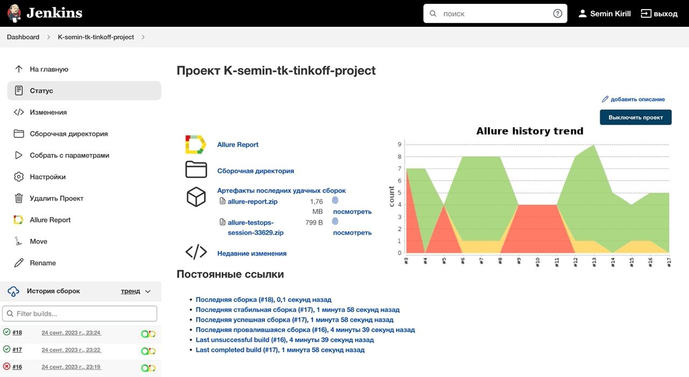
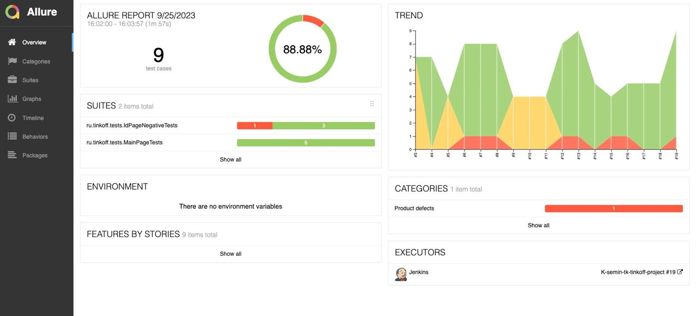
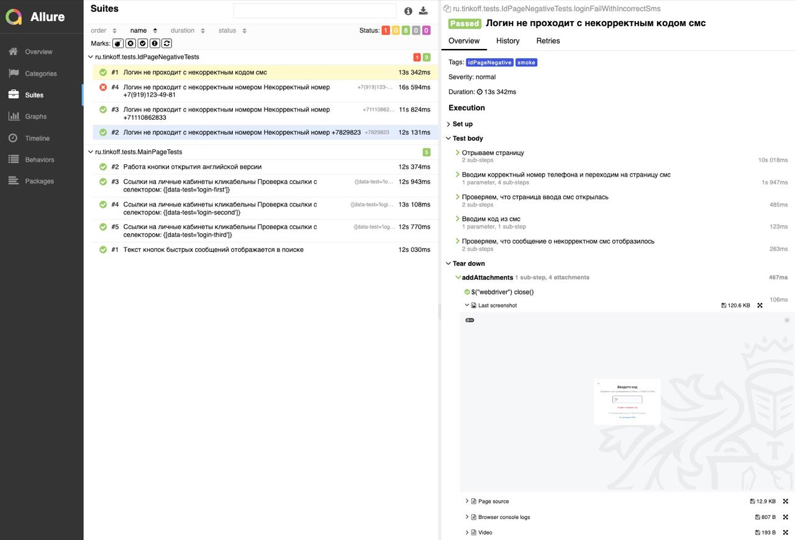
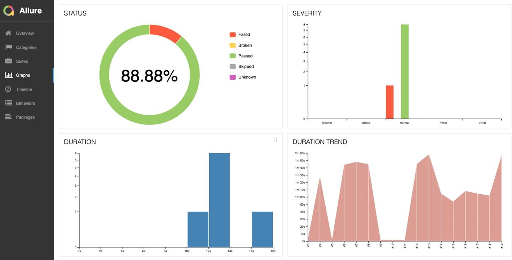
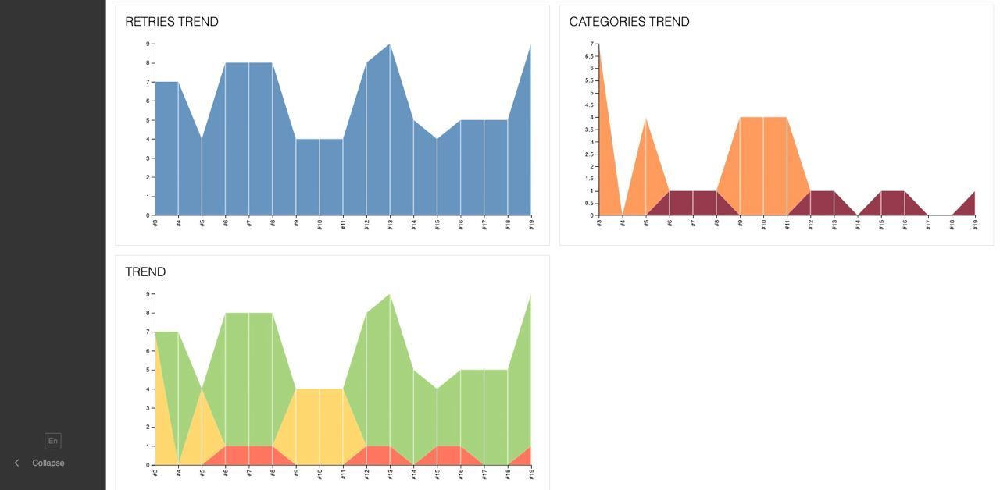
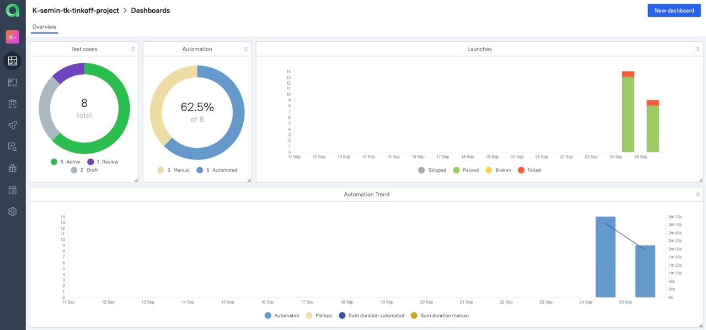
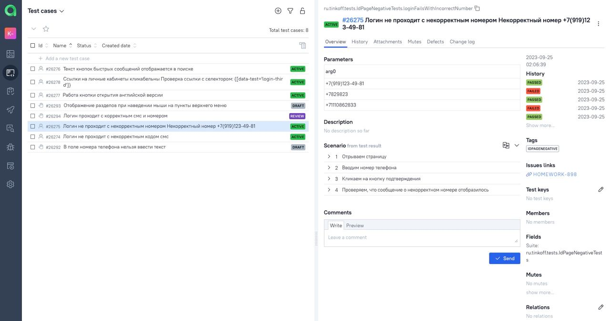
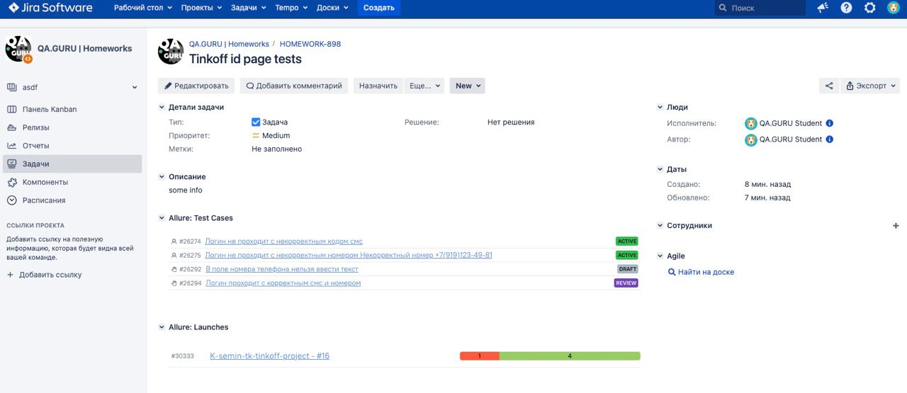

# Проект по автоматизации тестирования для компании [Тинькофф](https://www.tinkoff.ru/)

> Тинькофф — онлайн-экосистема, основанная на финансовых и лайфстайл-услугах. Клиентами Тинькофф стали 36 млн человек по всей России.
>> Тинькофф — третий крупнейший банк страны по количеству активных клиентов.

## **Содержание:**

* <a href="#tools">Технологии и инструменты</a>

* <a href="#cases">Примеры автоматизированных тест-кейсов</a>

* <a href="#jenkins">Сборка в Jenkins</a>

* <a href="#console">Запуск из терминала</a>

* <a href="#allure">Allure отчет</a>

* <a href="#allure-testops">Интеграция с Allure TestOps</a>

* <a href="#jira">Интеграция с Jira</a>

* <a href="#telegram">Уведомление в Telegram при помощи бота</a>

* <a href="#video">Примеры видео выполнения тестов на Selenoid</a>

---

<a id="tools"></a>
## **🔨Технологии и инструменты:**</a>

| Java                                                                                                    | IntelliJ  <br>  Idea                                                                                              | GitHub                                                                                                    | JUnit 5                                                                                                          | Gradle                                                                                                    | Selenide                                                                                                        | Selenoid                                                                                                                 | Allure <br> Report                                                                                                        | Jenkins                                                                                                         | Jira                                                                                                                                   | Telegram                                                                                                           |                                                                                              Allure <br> TestOps |
|:--------------------------------------------------------------------------------------------------------|-------------------------------------------------------------------------------------------------------------------|-----------------------------------------------------------------------------------------------------------|------------------------------------------------------------------------------------------------------------------|-----------------------------------------------------------------------------------------------------------|-----------------------------------------------------------------------------------------------------------------|--------------------------------------------------------------------------------------------------------------------------|---------------------------------------------------------------------------------------------------------------------------|-----------------------------------------------------------------------------------------------------------------|----------------------------------------------------------------------------------------------------------------------------------------|--------------------------------------------------------------------------------------------------------------------|-----------------------------------------------------------------------------------------------------------------:|
| <a href="https://www.java.com/"></a> | <a href="https://www.jetbrains.com/idea/"></a> | <a href="https://github.com/"></a> | <a href="https://junit.org/junit5/"></a> | <a href="https://gradle.org/"></a> | <a href="https://selenide.org/"></a> | <a href="https://aerokube.com/selenoid/"></a> | <a href="https://github.com/allure-framework"></a> | <a href="https://www.jenkins.io/"></a> | <a href="https://www.atlassian.com/software/jira/"></a> | <a href="https://web.telegram.org/"></a> |    <a href="https://qameta.io/"></a> |

---

<a id="cases"></a>
## 🏁 Реализованные проверки:

- Логин с некорректным номером
- Логин с некорректным смс
- Открытие личных кабинетов
- Работоспособность кнопок быстрых сообщений в поиске
- Переключение на аглийскую версию

---

<a id="jenkins"></a>
##  Сборка в [Jenkins](https://jenkins.autotests.cloud/job/K-semin-tk-tinkoff-project/)

<p align="center">  
  
</p>

## 📋 Параметры сборки в Jenkins:

- _WD_HOST (URL Selenoid, по умолчанию selenoid.autotests.cloud/wd/hub)_
- _WD_USER (User Selenoid, по умолчанию user1:1234)_
- _TASK (Задачи, по умолчанию test)_
- _BROWSER (Браузер, по умолчанию chrome)_
- _BROWSER_VERSION (Версия браузера, по умолчанию 100.0)_
- _WINDOW_SIZE (Размер окна браузера, по умолчанию 2560x1440)_
- _QA_ENGINEER (Дежурный QA в нотификации)_

---

<a id="console"></a>
## 🚀 Команда для запуска автотестов из терминала

Удаленный запуск с использованием Jenkins и Selenoid (требуется логин и пароль):
```bash  
./gradlew clean test -Denv=remote
```

---

##  </a>Интеграция с <a target="_blank" href="https://jenkins.autotests.cloud/job/K-semin-tk-tinkoff-project/allure/">Allure Report</a>

---

## 🖨️ Основная страница отчёта

<p align="center">  
  
</p>  

## 📄 Тест-кейсы

<p align="center">  
   
</p>

## 📊 Графики

<p align="center">   
  
  
</p>

---

##  </a>Интеграция с <a target="_blank" href="https://allure.autotests.cloud/project/3688/dashboards">Allure TestOps</a>

---

## 🖨️ Основная страница отчёта

<p align="center">  
  
</p>  

## 📄 Авто и Ручные тест-кейсы

<p align="center">  
  
</p>

## </a> Интеграция с <a target="_blank" href="https://jira.autotests.cloud/browse/HOMEWORK-891">Jira</a>

<p align="center">  
  
</p>
